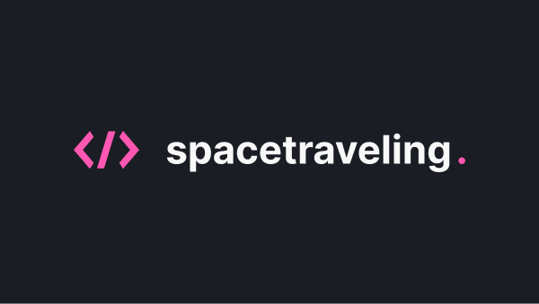

<p align="center">
  
</p>

<p align="center">
  <a href="#-tecnologias">Tecnologias</a>&nbsp;&nbsp;&nbsp;|&nbsp;&nbsp;&nbsp;
  <a href="#-preview">Preview</a>&nbsp;&nbsp;&nbsp;|&nbsp;&nbsp;&nbsp;
  <a href="#-getting-started">Getting started</a>&nbsp;&nbsp;&nbsp;|&nbsp;&nbsp;&nbsp;
  <a href="#-projeto">Projeto</a>&nbsp;&nbsp;&nbsp;|&nbsp;&nbsp;&nbsp;
  <a href="#-template">Template</a>&nbsp;&nbsp;&nbsp;|&nbsp;&nbsp;&nbsp;
  <a href="#-license">License</a>
</p>

## 🧪 Tecnologias

Este projeto utiliza as seguintes tecnologias:

- [Next.js](https://nextjs.org/)
- [TypeScript](https://www.typescriptlang.org/)
- [SASS](https://sass-lang.com/)

<!-- ## 🔥 Preview

Clique na imagem para ver a preview do blog. Ou se preferir clique [aqui](). -->

<br>

<p align="center">
  <a href="https://spacetravelling-vf.vercel.app/" target="_blank">
    
  </a>
</p>

## 🚀 Getting started

### Pré-requisitos

Antes de começar, você vai precisar ter instalado em sua máquina as seguintes ferramentas:
[Git](https://git-scm.com), [Node.js](https://nodejs.org/en/).
Além disto é bom ter um editor para trabalhar com o código como [VSCode](https://code.visualstudio.com/)

### 🎲 Rodando o projeto

```bash
# Clone este repositório
$ git clone https://github.com/felipersdf/ignite-desafio-reactjs-criando-um-projeto-do-zero

# Acesse a pasta do projeto no terminal/cmd
$ cd ignite-desafio-reactjs-criando-um-projeto-do-zero

# Instale as dependências
$ yarn

# Execute a aplicação em modo de desenvolvimento
$ yarn dev

# O servidor inciará na porta:3000 - acesse <http://localhost:3000>
```

## 📝 Projeto

### spacetravelling - Desafio 03 | Bootcamp Ignite - ReactJS

Neste desafio foi passado a ideia de criar um **blog do zero** utilizando o Next.js.

Um template do figma foi fornecido para que pudessemos fazer um blog de acordo com as especificações de um designer, assim como numa aplicação real.

A complexidade do **Desafio Principal** estava em consumir a informação de um **CMS [prismic.io](Prismic)**, este que contém nossas publicações. Utilizamos também algumas das funcionalidades principais do Next.js, como o getStaticProps usado para SSG **(Static Side Generate)** e assim otimizar nosso site para o SEO; e também a forma de consumir parâmetros nas rotas.

<!-- No **Desafio Complementar** foi preciso adicionar algumas features ao blog. Dentre estas, adicionar um chat in-real-time para que quando alguém comentasse algo sobre o post do blog já aparecesse o conteúdo, para isso foi utilizado o [Utterance](https://utteranc.es/); **Next and Prev Page**, para que em cada post do nosso blog apareça uma sugestão de página para navegação baseando-se na data de criação.

E o **Desafio Complementar** com maior complexidade estava em adicionar um **Preview Mode** para que não tenha necessidade postar a publicação para poder ter acesso ao resultado direto no layout. Para isso utilizamos as **API ROUTES** do Next.js para tratamento das informações e setá-las. -->

Projeto desenvolvido durante Bootcamp Ignite da [@Rocketseat](https://github.com/Rocketseat).

## 🖥 Template

Você pode acessar o template do desafio em:

- [Template Challenge](https://github.com/rocketseat-education/ignite-template-reactjs-criando-um-projeto-do-zero)

## ✉ License

Projeto licenciado pelo MIT.

---
